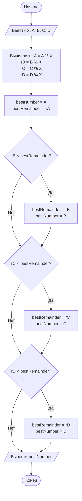

## Отчет по лабораторной работе № 1

#### № группы: `ПМ-2602`

#### Выполнил: `Платонова Алина Алексеевна`

#### Вариант: `17`

### Cодержание:

- [Постановка задачи](#1-постановка-задачи)
- [Входные и выходные данные](#2-входные-и-выходные-данные)
- [Выбор структуры данных](#3-выбор-структуры-данных)
- [Алгоритм](#4-алгоритм)
- [Программа](#5-программа)
- [Анализ правильности решения](#6-анализ-правильности-решения)

### 1. Постановка задачи

> На вход программы подаются четыре целых чисел A, B, C, D. Необходимо
определить число, имеющее наименьший остаток от деления на число X.
На вход программы подаются натуральное число X и пять целых чисел A,
B, C, D.

Для решения данной задачи нам необходимо:

- Ввести все необходимые данные
- Найти все остатки от деления числа X на числа A, B, C, D
- Среди всех остатков найти наименьший

### 2. Входные и выходные данные

#### Данные на вход

На вход программа должна получать 5 чисел, при этом в условии не сказано к какому типу
принадлежат данные числа, поэтому будем считать их целочисленными. Верхняя и нижняя границы получаемых 
чисел не даны, поэтому используем целочисленный тип с максимальной вместимостью, для поиска остатков у больших чисел.
  
|             | Тип                | 
|-------------|--------------------|
| X (Число 1) | Целочисленный      |
| A (Число 2) | Целочисленный      |
| B (Число 3) | Целочисленный      |
| C (Число 4) | Целочисленный      |
| D (Число 5) | Целочисленный      |


#### Данные на выход

В качестве ответа программа должна вывести одно из чисел A, B, C, D.

|         | Тип                                | 
|---------|------------------------------------|
| Ответ   | Целочисленный                      | 

### 3. Выбор структуры данных

Программа получает 5 чисел, поэтому для их хранения
можно выделить 5 переменных (`x`,`a`,`b`,`c`,`d`) типа `long`. 

|             | Тип                | Название в Java|
|-------------|--------------------|----------------|
| X (Число 1) | Целочисленный      |long            |
| A (Число 2) | Целочисленный      |long            |
| B (Число 3) | Целочисленный      |long            |
| C (Число 4) | Целочисленный      |long            |
| D (Число 5) | Целочисленный      |long            |


Для поиска наименьшего остатка и вывода результата создадим переменные `bestRemainder` и `bestNumber`, которым и будем присваивать значения наименьшего остатка и числа, которое нужно будет вывести в качестве ответа.

### 4. Алгоритм

#### Алгоритм выполнения программы:

1. **Ввод данных:**  
   Программа считывает пять чисел, обозначенные как X, A, B, C, D.

2. **Нахождение остатков:**  
   Делим число X на числа A, B, C, D и присваиваем полученные значение новым переменным.

3. **Поиск наименьшего из остатков и соответствующего ему числа**
   - Присваеваем переменным `bestRemainder` и `bestNumber` значения остатка от деления A на X и самого А.
   - Далее начинаем сравнивать `bestRemainder` с остатками от деления X на другие заданные числа. В случае если другой остаток от деления окажется меньше `bestRemainder` мы присвоим переменной его значение. Таким образом найдем наименьший остаток и присвоим переменной `bestNumber` число, которое дало нам соответствующий остаток

4. **Вывод результата:**  
   На экран выводится `bestNumber` - число, давшее нам наименьший остаток при делении на X.
   #### Блок-схема



### 5. Программа

```java;
import java.util.Scanner;

public class Main {
    public static void main(String[] args) {
        Scanner sc = new Scanner(System.in);

        long X = sc.nextLong();

        long A = sc.nextLong();
        long B = sc.nextLong();
        long C = sc.nextLong();
        long D = sc.nextLong();

        long rA = A % X;
        long rB = B % X;
        long rC = C % X;
        long rD = D % X;

        long bestNumber = A;
        long bestRemainder = rA;

        if (rB < bestRemainder) {
            bestRemainder = rB;
            bestNumber = B;
        }
        if (rC < bestRemainder) {
            bestRemainder = rC;
            bestNumber = C;
        }
        if (rD < bestRemainder) {
            bestRemainder = rD;
            bestNumber = D;
        }

        System.out.println(bestNumber);
    }
}
```
### 6. Анализ правильности решения


### Пример 1
**Ввод:**
```
7
10 15 22 30
```
**Вывод:**
```
15
```

### Пример 2
**Ввод:**
```
5
3 8 13 18
```
**Вывод:**
```
3
```
*(все остатки равны 3, выводится первое число)*

### Пример 3
**Ввод:**
```
10
25 47 63 81
```
**Вывод:**
```
81
```
*(остатки: 5, 7, 3, 1 → минимум у 81)*
